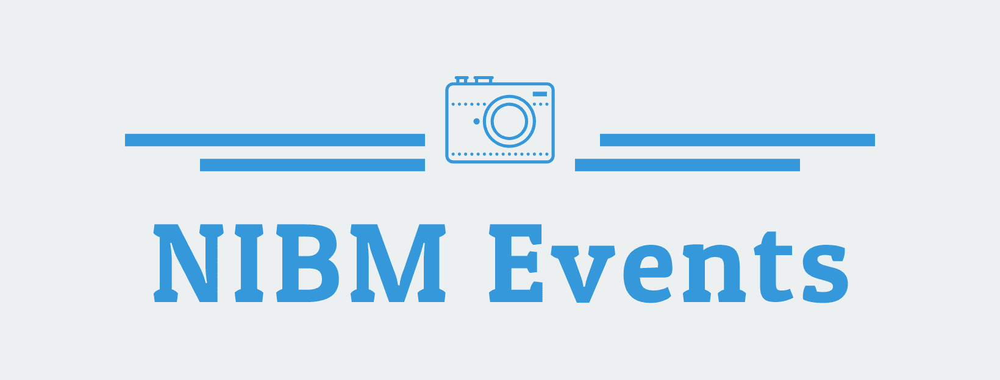

# NIBM Events

Share and communicate with bachelors during an Event at NIBM.

This application is used to simulates how students can manage and share a event at NIBM with other colleagues. It is built on top of Swift with several 3rd party libraries, serving as a single application.

## Technologies

Usage          	            | Technology   
--------------------------	| --------------------------
Language                   	| Swift 5.0                      
Unit Testing Framework     	| XCTest                                         
Build Tool                 	| Xcodebuild                                         
Logger                    	| SwiftyBeaver
Logger                        | SwiftLint
Stream Communication               | RxSwift
Database                    | FireStore
Keyboard Manager            | IQKeyboardManagerSwift
Dependency Management Tool 	| CocoaPods
Development IDE             | XCode 10.3

## Support

Constraints work with, from iPhone 6 to latest iPhone devices.

## Getting Started

Development and build dependencies are managed via cocoapods repository.

Commands under `ios-cobsccomp182p-010` directory.

Run `pod install` to install development and build system dependencies.

## Special Notes

Minimum 8 characters at least 1 Uppercase, 1 Lowercase, 1 Number and 1 Special Character password is required and email domain name must be within example@student.nibm.lk

## Sample Credentials

`Username: aravinda@student.nibm.lk`
`Password: Ara@123`

Screenshots

Drive Folder: [Link](https://drive.google.com/drive/folders/1GanHnT-r5NZzSHcolqyBiVrLfyajaP9O?usp=sharing)
