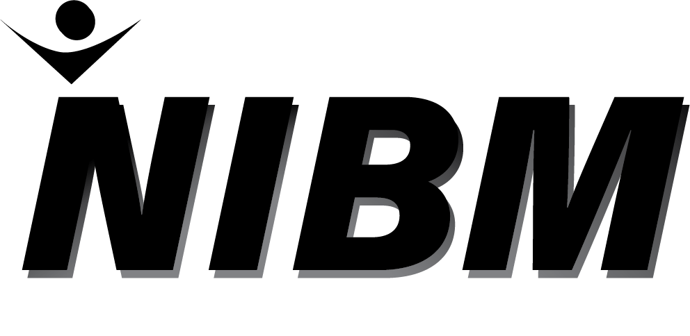

# NIBM Events

Share and communicate with bachelors during a Event at NIBM.

This application is used to simulates how students can manage and share a event at NIBM with other friends and staff. It is built on top of Swift with several 3rd party libraries, serving as a single application

## Technologies

Usage          	            | Technology   
--------------------------	| --------------------------
Language                   	| Swift 5.0                      
Unit Testing Framework     	| XCTest                                         
Build Tool                 	| Xcodebuild                                         
Code Quality Tools         	| SwiftLint
Logger                    	| SwiftyBeaver
Communication               | RxSwift
Database                    | FireStore
Keyboard Manager            | IQKeyboardManagerSwift
Dependency Management Tool 	| CocoaPods
Development IDE             | XCode 10.3

## Support

Constraints work with, iPhone 7 Plus, 8 Plus with portrait mode.

## Getting Started

Development and build dependencies are managed via cocoapods repository.

Commands under `ios-cobsccomp182p-010` directory.

Run `pod install` to install development and build system dependencies.

